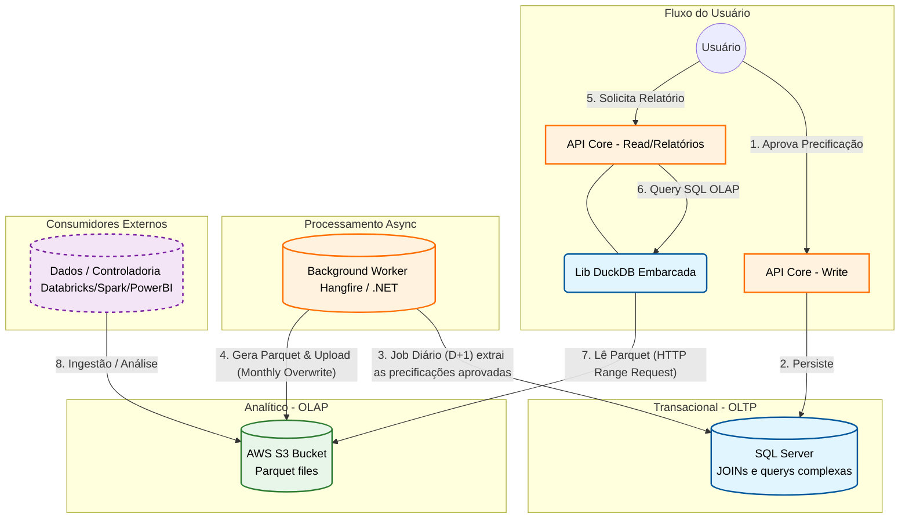
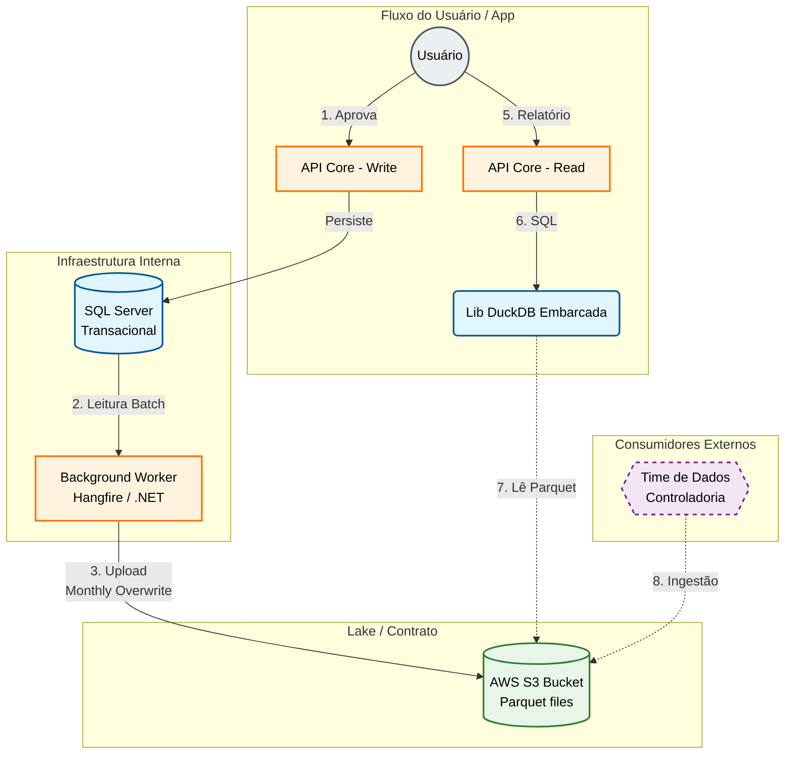

# Low Cost Data Mesh

## Ferramentas

## Arquitetura

```mermaid
flowchart TD
    %% Estilos e Definições
    classDef database fill:#e1f5fe,stroke:#01579b,stroke-width:2px,color:#000
    classDef component fill:#fff3e0,stroke:#ff6f00,stroke-width:2px,color:#000
    classDef storage fill:#e8f5e9,stroke:#2e7d32,stroke-width:2px,color:#000
    classDef external fill:#f3e5f5,stroke:#7b1fa2,stroke-width:2px,stroke-dasharray: 5 5,color:#000

    subgraph UserInteraction [Fluxo do Usuário]
        User((Usuário))
        API_Write[API Core - Write]:::component
        API_Read[API Core - Read/Relatórios]:::component
        DuckDB(Lib DuckDB Embarcada):::database
    end

    subgraph OLTP [Transacional - OLTP]
        SQLServer[(SQL Server
        JOINs e querys complexas)]:::database
    end

    subgraph Processing [Processamento Async]
        Worker[(Background Worker Hangfire / .NET)]:::component
    end

    subgraph DataLake [Analítico - OLAP]
        S3Bucket[(AWS S3 Bucket
        Parquet files)]:::storage
    end

    subgraph Consumers [Consumidores Externos]
        DataTeam[(Dados / Controladoria Databricks/Spark/PowerBI)]:::external
    end

    %% Relacionamentos - Fluxo de Escrita
    User -- 1. Aprova Precificação --> API_Write
    API_Write -- 2. Persiste --> SQLServer

    %% Relacionamentos - Fluxo de Extração (ETL)
    Worker -- 3. Job Diário (D+1) extrai as precificações aprovadas --> SQLServer
    Worker -- 4. Gera Parquet & Upload (Monthly Overwrite) --> S3Bucket

    %% Relacionamentos - Fluxo de Leitura (Interno)
    User -- 5. Solicita Relatório --> API_Read
    API_Read -- 6. Query SQL OLAP --> DuckDB
    DuckDB -- 7. Lê Parquet (HTTP Range Request) --> S3Bucket

    %% Relacionamentos - Fluxo de Leitura (Externo)
    DataTeam -- 8. Ingestão / Análise --> S3Bucket

    %% Link do DuckDB
    API_Read --- DuckDB
```

---
### Arquitetura 3

```mermaid
    flowchart TD
    %% Estilos
    classDef database fill:#e1f5fe,stroke:#01579b,stroke-width:2px,color:#000
    classDef component fill:#fff3e0,stroke:#ff6f00,stroke-width:2px,color:#000
    classDef storage fill:#e8f5e9,stroke:#2e7d32,stroke-width:2px,color:#000
    classDef external fill:#f3e5f5,stroke:#7b1fa2,stroke-width:2px,stroke-dasharray: 5 5,color:#000
    classDef user fill:#eceff1,stroke:#455a64,stroke-width:2px,color:#000

    %% 1. Fluxo do Usuário (Mantido Vertical como você gostou)
    subgraph UserApp [Fluxo do Usuário / App]
        User((Usuário)):::user
        API_Write[API Core - Write]:::component
        API_Read[API Core - Read]:::component
        DuckDB(Lib DuckDB Embarcada):::database
        
        User -- 1. Aprova --> API_Write
        User -- 5. Relatório --> API_Read
        API_Read -- 6. SQL --> DuckDB
    end

    %% 2. Infraestrutura Interna (AQUI MUDAMOS: SQL Esq -> Worker Dir)
    subgraph Backend [Infraestrutura Interna]
        direction LR  %% Força orientação Esquerda-Direita SÓ aqui dentro
        SQLServer[(SQL Server<br/>Transacional)]:::database
        Worker[Background Worker<br/>Hangfire / .NET]:::component
        
        %% Conexão interna para forçar o layout visual
        SQLServer --> |2. Leitura Batch| Worker
    end

    %% 3. Lake (Canto Inferior Direito)
    subgraph DataLake [Lake / Contrato]
        S3Bucket[(AWS S3 Bucket<br/>Parquet files)]:::storage
    end

    %% 4. Consumidores (Abaixo)
    subgraph Consumers [Consumidores Externos]
        DataTeam{{Time de Dados<br/>Controladoria}}:::external
    end

    %% CONEXÕES ENTRE OS BLOCOS
    
    %% Persistência
    API_Write --> |Persiste| SQLServer

    %% Exportação (Worker joga para baixo no S3)
    Worker --> |3. Upload<br/>Monthly Overwrite| S3Bucket

    %% Leituras
    DuckDB -.-> |7. Lê Parquet| S3Bucket
    DataTeam -.-> |8. Ingestão| S3Bucket
```